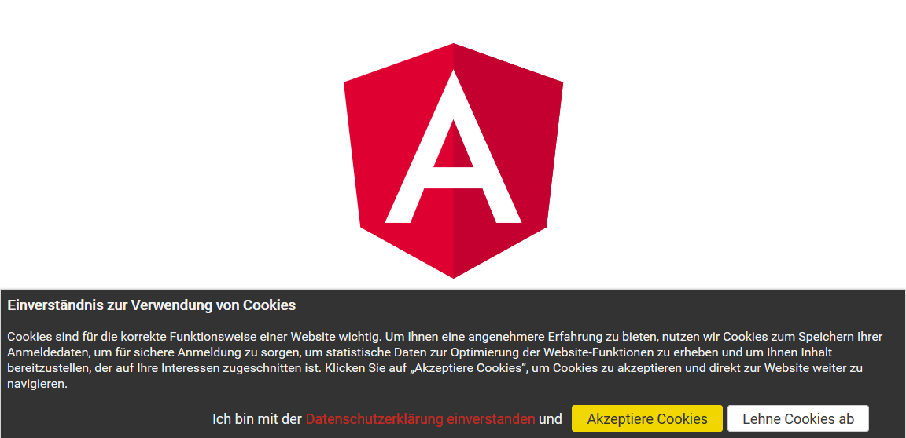

# n4v-privacy-sidebar

My n4v-privacy-sidebar is an UI component for [Angular](https://angular.io) >= 4 based on the great [PrimeNG](https://www.primefaces.org/primeng/) UI framework.

It is a finished UI component, which provides a styled bottom bar for explaining cookie usage and asking your app users and site visitors for the permission to use cookies.



## Features

* Ready for usage out of the box
* Neutral style
* Translatable (some languages included, see below)
* Observable to attach your own decisions or workflow based on the decision of visitors
* Rembers decision of visitor
* Stylable on your needs


## Included languages

The source provides in folder `lib/assets/n4v-privacy-sidebar` the files

- de.json for all German based languages
- en.json for all English based languages

All other browser languages are defaulted to English.

You are welcome to provide some translations of the json-file!


## Installation

It is available as npm package and installable with npm command:

`npm i --save n4v-privacy-sidebar`

The following peer dependencies need to be installed:

1. @angular/animations
1. @angular/common
1. @angular/core
1. primeng@^5.0.0

Angular is supported in version 4 or 5. The @angular dependencies should be installed already in your app.


## Configuration

In your `.angular-cli.json` file you need to add something like:

```
  "assets": [
    { "glob": "**/*", "input": "../node_modules/n4v-privacy-sidebar/assets", "output": "./assets" },
    "assets",
    "favicon.ico"
  ],
```

The **path** depends on your root-configuration.

It is reponsible that the **translated** json-files from the library got installed in your app and are available during runtime.  
If there is no text viewable in the sidebar, it is most likely a mismatch in the provided path. You can also specify an absolute path.


## Code example

At first there is the demo app available in this repository.

All you would need to do is...

```
import { CookieService, PrivacySidebarModule } from 'n4v-privacy-sidebar';

@NgModule({
  declarations: [
    ...
  ],
  imports: [
    BrowserAnimationsModule,
    ...
    PrivacySidebarModule
  ],
  providers: [CookieService],
  bootstrap: [AppComponent]
})
export class AppModule { }
```

The **CookieService** should be added to your AppModule or your CoreModule (if available).  
This should become an app wide singleton service provider.

The **PrivacySidebarModule** with its declaration of the `<n4v-privacy-sidebar></n4v-privacy-sidebar>`-tag can also be imported in a **Component**.

Then add the `<n4v-privacy-sidebar></n4v-privacy-sidebar>`-tag to a template.

That's enough to show the complete **n4v-privacy-sidebar** at the bottom of your site.


## Observing visitor decision

At first **inject** the **CookieService** to your **Component**:

```
import { CookieService } from 'n4v-privacy-sidebar';

export class ...

  constructor(private cookieService: CookieService) {
```

Then create your **Observer**-object:

```
  const observer: Observer<boolean> = {
      complete: () => { console.log('cookieService completed'); },
      error: (err: Error) => { console.error(err.stack); },
      next: value => { console.log('detected a cookieService value change: %s', value.toString()); }
    };
    this.cookieService.subscribe(observer);
  }
```

If you don't overwrite the standard behavior on yourself, it is enough to handle **complete**.  
On complete the visitor has accepted cookie usage and you can call code to set your cookies.

On a **value** change in **next** you can handle true and false value. For example on false you can show the visitor what he will miss without cookies. Just an example.


## Customizing

### CookieService

- `closeOnClick`
  If you set this to false, you have to handle the **removal** of the sidebar **by yourself**.

- `closeOnAccept`
  If you want to close only on **decline**, set this to false and do some custom stuff.


### `<n4v-privacy-sidebar>`

You can set the following attributes on the **`<n4v-privacy-sidebar>`**-tag:
```
  @Input() styleClass = '';
  @Input() privacyUrl = '';
  @Input() sidebarContent = '';
  @Input() sidebarHeader = '';
  @Input() sidebarFooter = '';
  @Input() acceptCookies = '';
  @Input() declineCookies = '';
```

This will **overwrite** the translated content from json-files. So if needed you have to handle translation by yourself.

If you set a **styleClass**, this will be appended to the **HTML** class-attributes. So you can style the **`<n4v-privacy-sidebar>`** by yourself.

For example, you want to style and there is no need for dependency of the URL on the language, you might use something like:

`<n4v-privacy-sidebar styleClass="my-fancy-hip-style" privacyUrl="https://www.example.com/pathToPrivacyPolicy"></n4v-privacy-sidebar>`


Last but not least ...


### **assets/n4v-privacy-sidebar/ab{-xy}.json**

```
{
  "header": "Confirmation for Cookie Usage",
  "content": "Cookies are important ... Click \"Accept cookies\" to go directly to the site.",
  "footer": "I confirm {{LINK}}Privacy Policy{{LINK}} and",
  "accept": "Accept cookies",
  "decline": "Decline cookies",
  "url": "/privacy"
}
```

I think this is self-explanatory.

`{{LINK}}` is the open and closing tag, which will get replaced with a real hyperlink to the **url**-property.  
This works also in the **`<n4v-privacy-sidebar>`**-attributes from above.

The detection is based on the languages configured in browser with last fallback to **en.json**.

It is a best match thing.  
If you provide en.json and en-us.json (files need to be **lowercase**), browser has en-US in its language list, en-us.json will be used.  
If browser only has en-GB in its list, we will use en.json.
If the language list is de-DE, en-GB, en, de and we provide de.json and not de-de.json. Anything else doesn't matter.  
Then we will use de.json.

You can provide your own json-files with an assets configuration in **.angular-cli.json** similiar to the one above.
